#  My home multi zone smart heating configuration with the use of Home Assistant

Date first published: July 1 2021  
Latest modification: February 20 2022

By: Johan F.

## 1. Introduction

Home Assistant is Open Source software that runs on various devices, for instance Raspberry Pi, and acts as a central server for smart home devices and/or self build modules to make automatizations in the home. It has an active community and a large library of integrations with products on the market. Home Assistant is a non-cloud system, which means there is not necessarily a dependance on external cloud services and an internet connection.


Website Home Assistant: [home-assistant.io](https://www.home-assistant.io)

With the use of Home Assistant I created a multi zone smart thermostat, which I was able to customize to my personal situation. Against low costs, about  $50, and all wired to limit the EMF radiation in the home. In this document I will describe my configuration. I am Dutch, so the names I chose for various entities are in Dutch.

**Screenshots of my dashboard:**

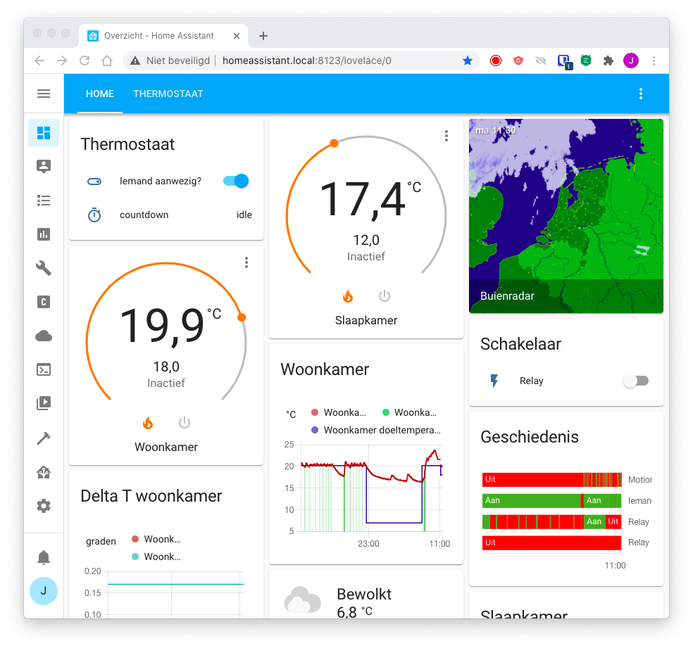

Here is a tab with variables:

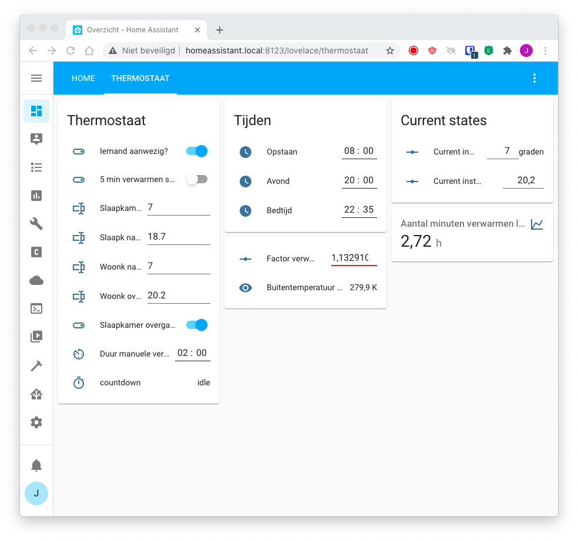

And on my phone:

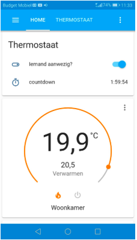



## 2. Floor plan of my apartment 

My appartement consists of a living room, a bedroom and a kitchen.

<table><tbody><tr><td><figure class="image">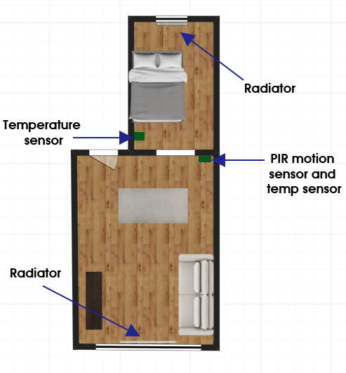</figure></td></tr><tr><td>A schematic view of the floor plan with the relevant rooms</td></tr></tbody></table>

<table><tbody><tr><td><figure class="image">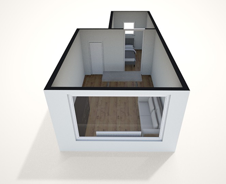</figure></td></tr><tr><td>A 3D view of the floorplan, the door between living room and bedroom can be closed off<br>(made with <a href="https://roomstyler.com/3dplanner">https://roomstyler.com/3dplanner</a>)</td></tr></tbody></table>

The appartement has a boiler (Intergas kompakt hre 24/18) for central heating which can use a on-off control and OpenTherm.  

<table><tbody><tr><td><figure class="image"></figure></td></tr><tr><td>Intergas hre 24/18</td></tr></tbody></table>

## 3. The design wishes for the system

*   Multi zone: Heat the bedroom to a desired temperature at night (while living room radiator closed) and the living room during the day and evening (while bedroom radiator closed)
*   Turn off the thermostat function when no one home
*   A wired system, that doesn't use wifi, to limit the use of EMF-radiation in the home. See [this TED talk](https://www.youtube.com/watch?v=F0NEaPTu9oI) about possible dangers of EMF radiation in the living environment.
*   A smartphone app and / or a browser to control and monitor the thermostat
*   Send alerts to the smartphone when certain conditions are met, e.g. when it is suspected that a window is open.
*   Reverting to normal set temperature after a certain amount of time after a manual change
*   Easily setting variables like bedtime, waking time and revert-to-initial-time with input fields in the front-end

## 4. Software

[Home Assistant](https://www.home-assistant.io/) (The main platform on which everything is running)

Installation instructions for Home Assistant can be found on the [Getting Started](https://www.home-assistant.io/getting-started/) page of the Home Assistant website. 

**Download location Home-Assistant OS** for Pi Zero W, used in this configuration, is not listed on the website but is available at: [https://github.com/home-assistant/operating-system/releases](https://github.com/home-assistant/operating-system/releases) for pi Zero W choose: hassos\_rpi0-w-x.xx.img.xz. 

Note: Since the release of HA OS 7.0 the Pi Zero isn't supported anymore. See [this Github Pull request](https://github.com/home-assistant/operating-system/pull/1638). The 6.6 version is still available for download. However it is uncertain how long the Home Assistant latest core will be running on this version 6. For running a future proof hardware configuration, the RPi3 or above seems to be a better choice.

Arduino IDE (for uploading Arduino sketches to the arduino mcu)

**Home assistant integrations for the thermostat**

Several integrations are used. The most important is the Generic Thermostat integration, designed to act as a on-off thermostat with a switch:

*   [Generic Thermostat integration](https://www.home-assistant.io/integrations/generic_thermostat/)

## 5. Hardware

**Bedroom**

Plastic container with a hole cut out with a 5 meter USB extension cable to the server.


In this container.

*   Arduino nano with a DS18B20 temperature sensor connected via long USB cable (4 meter) to the Home Assistant server

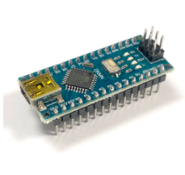

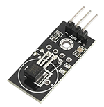

Store: [Aliexpress](https://nl.aliexpress.com/item/1005002674336082.html)

An arduino sketch is flashed to the arduino nano. The ouput of this sketch will be sent to serial via USB. As an alternative to coding a sketch for a USB connected arduino(like) device, [Firmata](home-assistant.io/integrations/firmata/), can also be considered. With firmata it is easy to create a YAML file to add sensors and actuators and have them outputted to Home Assistant. 

This setup uses a USB serial connection, which is suitable, as this is a small appartement, with just two rooms. For larger house there are other wired alternatives, see the Wired alternatives section. 



**Living room**

**Server with sensors:**


Case: [Aliexpress](https://s.click.aliexpress.com/e/_ABlPWR)  
PIR case (only used as case and fitted in 5V PIR): [Aliexpress](https://s.click.aliexpress.com/e/_A9CbmJ)

Contains:

*   Raspberry pi Zero W (acts as server) with:

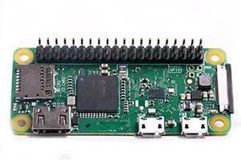

*   DS18B20 temperature sensor


Store: [Aliexpress](https://nl.aliexpress.com/item/1005002674336082.html)

Note: DHT11/22 sensors don't work with pi0 and Home Assistant (driver not provided), if desired use an Arduino with DHT sensor and connect to Home Assistant.

*   PIR motion sensor module

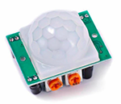

Store: [Aliexpress](https://s.click.aliexpress.com/e/_9HU2TH)

There are two set screws on this module, one is for measure distance and one for sensitivity (how long the signal is high)

*   Relay module with wire connected to boiler for controlling on-off heating


Store: [Aliexpress](https://s.click.aliexpress.com/e/_A5z0ab)

*   USB hub with Ethernet and connected USB storage device for the OS.  
    Note: an SSD drive will give a higher expected lifetime than a USB or SD card, as these are known for their limited I/O read and write cycles.
*   MicroSD with [bootcode.bin file](https://www.raspberrypi.org/documentation/computers/raspberry-pi.html#raspberry-pi-boot-modes) (needed, as pi0 doesn't boot from USB by default)

**Connnected together:**

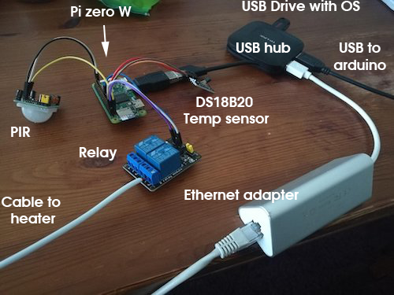

In casing:

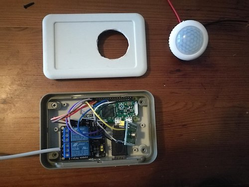

The casing is too small to fit al the parts, so the USB hub is connected outside the casing. 

**Note about the pi0**  
The pi Zero W is the Raspberry with the least powerful specifications. However, it does run well for a year now, as I only use it for nothing else than the thermostat function. The larger Raspberry pi boards have headers, the GPIO pins, soldered to to them. For Pi0 you can choose to buy a headerless of with header. I prefer the one already soldered, as it is only a couple of bucks more.

**Download location Home-Assistant OS** for pi0 at: [https://github.com/home-assistant/operating-system/releases](https://github.com/home-assistant/operating-system/releases) for pi Zero W choose: hassos\_rpi0-w-x.xx.img.xz. 

**Note**: Since the release of HA OS 7.0 the Pi Zero isn't supported anymore. See [this Github Pull request](https://github.com/home-assistant/operating-system/pull/1638). The 6.6 version is still available for download. However it is uncertain how long the Home Assistant latest core will be running on this version 6. For running a future proof hardware configuration, the RPi3 or above seems to be a better choice.

**Thermostatic radiator valves**  
Both rooms have one radiator, each is equipped with an eqiva-N thermostatic radiator valve (TRV). These are only used to open and close the radiators at the beginning and end of the day. They are programmed to setpoint 12° C when the desired heating for the room is off and to 25° C when the desired heating is on. 

**Limitations**  
The limitation of using these TRVs is that they aren't being set from within Home Assistant, as I chose a TRV without connectivity. Therefore it is important to keep in mind that there is a risk that they aren't synced to the times set in Home Assistant, as their program needs to be set separately.   
Another limitation is that when the set temperature of the bedroom during the day is set higher than the current room temperature, the boiler will start heating but no heat will arrive at the room, as the radiator is closed. Of course it is possible to open the valve manually.   

<table><tbody><tr><td><figure class="image">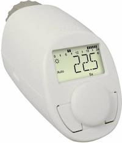</figure></td></tr><tr><td><i>The eqiva-N thermostatic radiator valve (TRV)</i></td></tr></tbody></table>

Radiator valve before:

<table><tbody><tr><td><figure class="image"></figure></td></tr><tr><td><i>The Herz valve knob - old situation</i></td></tr></tbody></table>

There were no thermostatic valves on my radiator (just a turn knob), to get it working with the Eqiva TRV I had to put in a new insert, part #1639091 for Herz radiator valves:  

<table><tbody><tr><td><figure class="image"></figure></td></tr><tr><td><i>The Herz 1639091 insert to make the valve a thermostatic valve</i></td></tr></tbody></table>

An extra adapter was necessary to fit the eqiva-N TRV as it doesn't fit the Herz system with the adapters provided on in the package. 

<table><tbody><tr><td><figure class="image"></figure><p>&nbsp;</p></td></tr><tr><td><i>IMI adapter for Herz part no. 15071304</i></td></tr></tbody></table>

**Doorsprings**

A doorspring was put on both rooms door, so that they will be kept closed as much as possible to avoid heat loss.  

<table><tbody><tr><td><figure class="image"></figure></td></tr><tr><td><i>Doorspring for door closing</i></td></tr></tbody></table>

## 6. Home Assistant configuration 

### 6.1 Helpers 

Created the following helpers via configuration > helpers within Home Assistant

|   | Type | Name: |
| --- | --- | --- |
| **Someone home?** | input\_boolean (toggle) | input\_boolean.aanwezig |
| Go to bed time |   | input\_datetime.bedtijd |
| Evening time |   | input\_datetime.avond |
| Wake up time |   | input\_datetime.opstaan |
| Set temperature living room night |   | input\_text.woonk\_nacht |
| Set temperature living room day |   | input\_text.woonk\_overdag |
| Current set temperature living room according to program |   | input\_number.current\_insteltemp\_woonkamer |
| Countdown timer | timer | timer.countdown |
| Second to last movement recorded |   | input\_datetime.bewegingeennalaatst\_1 |
| Last movement recorded |   | input\_datetime.beweginglaatst\_0 |
| Current set temperature living room according to program |   | input\_number.current\_insteltemp\_slaapkamer |
| Hours and minutes for a manual change in set temperature before reverting to program |   | input\_datetime.duur\_manuele\_verhoging |
| Heating toggle switch for bedroom (used in generic thermostat as heating switch) |   | input\_boolean.schakelaar\_slaapkamer |
| Heating toggle switch for Living room (used in generic thermostat as heating switch) |   | input\_boolean.schakelaar\_woonkamer |
| Set temperature living room night |   | input\_text.slaapkamer\_insteltemp\_nacht |
| Set temperature living room day |   | input\_text.slaapkamer\_insteltemp\_overdag |

### 6.2 Variables

To easily change settings to which I would like them, I make use of input variables. I made a tab in Lovelace to edit this variables.

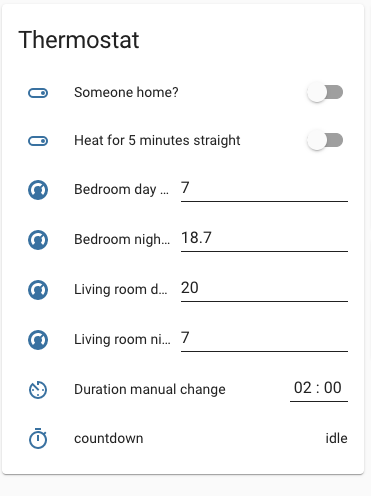

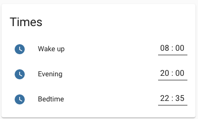

Most of them speak for themselves. The someone home switch is turned on depending on presence detection. When the set temperature of the thermostat is changed manually, it will revert back to the initial set temperature according to program after the set Duration manual change value. The countdown shows the amount of time left until revert to initial set temperature. 

### 6.3 Turning off wifi and bluetooth

As it is one of the design wishes to have an all wired system to limit the amount of EMF radiaton, bluetooth and wifi aren't used and turned off. 

This is done by adding to boot/config.txt

```
dtoverlay=disable-wifi                                                         
dtoverlay=disable-bt
```

You can enter the config.txt file on Windows by reading out your SD card or USB drive on your computer and opening the boot partition. On Mac it is possible to mount the boot drive and read it out, see instructions [here](https://community.home-assistant.io/t/pi-zero-with-enc28j60-ethernet-no-ethernet-found-solved/76509/3?u=johanf).  

### 6.4 Configuration.yaml

Only covering the relevant part of the configuration for the smart heating system. 

#### 6.4.1 Setting up sensors and relay

##### 6.4.1.1 Deprecation of Raspberry Pi GPIO read and write from Home Assistant

Note (february 20, 2020): From  Home Assistant version 2022.6 the support of GPIO reading and output, will be deprecated. Background on this can be read in [Architectural Decision Record 0019](https://github.com/home-assistant/architecture/blob/master/adr/0019-GPIO.md).  As an alternative for GPIO support a HACS integration is available, [ha-rpi\_gpio](https://github.com/thecode/ha-rpi_gpio). Other alternatives is using other connected microcontrollers and use the GPIO on those devices. 

##### 6.4.1.2 **DS18b20 temperature sensor**


To detect 1-wire temperature sensors on the Raspberry pi first add to your config.txt:

```yaml
dtoverlay=w1-gpio,gpiopin=4
```

You can enter the config.txt file on Windows by reading out your SD card or USB drivee on your computer and opening the boot partition. On Mac it is possible to mount the boot drive and read it out, see instructions [here](https://community.home-assistant.io/t/pi-zero-with-enc28j60-ethernet-no-ethernet-found-solved/76509/3?u=johanf). 

After this, add the 1-wire integration via Settings / Integrations / Add integration  


Restart Home Assistant and if configuration went well, a temperature sensor is detected and a name is assigned to it, similar to `sensor.28_011937d1c3d1_temperature`. 

More on configuring 1-wire sensors on the Home Assistant documentation:  [1-wire integration](https://www.home-assistant.io/integrations/onewire/).

##### 6.4.1.3 **Correction of temperature sensor**

My DS18B20 sensors ([onewire](https://www.home-assistant.io/integrations/onewire/)) need a correction to match the right temperature value. With the use of [template platform](https://www.home-assistant.io/integrations/template/) a correction is applied to the onewire sensors. 

It is actually best to calibrate a temperature sensor, based on a one or two point reference value (like water/ice), but I didn't bother. For my home, it is important that I can set certain thresholds. Whether these are very accurate isn't really important. I just set temperatures that I experience as a pleasant temperature.

See below:

```yaml

sensor:
  - platform: template
    sensors:
      ds18b20_woonkamer_correctie:
        value_template: "{{ states('sensor.28_00000913d350_temperature')|float - 1.2}}"
        friendly_name: 'Woonkamer temp'
        unit_of_measurement: degrees
 
```

##### 6.4.1.4 **Relay**


Added to configuration.yaml

```yaml
switch:
  - platform: rpi_gpio
    ports:
     5: Relay
```

More info on Home Assistant website: [rpi\_gpio integration](https://www.home-assistant.io/integrations/rpi_gpio/)

##### 6.4.1.5 **Motion sensor**


Connected to gpio pin 26

```yaml
binary_sensor:
  - platform: rpi_gpio
    invert_logic: false
    ports:
     26: Motion sensor
```

More info on Home Assistant website: [rpi\_gpio integration](https://www.home-assistant.io/integrations/rpi_gpio/)

After connecting set do desired behavior with the two set screws on the PIR module.  

##### 6.4.1.6 **Arduino**

First the sketch from the Hardware section was put on the Arduino nano, see the hardware section.

```yaml
 - platform: serial
    serial_port: /dev/serial/by-id/usb-FTDI_FT232R_USB_UART_A1083GTG-if00-port0
```

On the Home Assistant documentation for Arduino integration it is described that `serial_port: /dev/ttyUSB1` an be used. However, I noticed that on restarts the assignment of ttyUSB# can differ and therefore the readout of the Arduino can fail after restart. To make sure this doesn't happen the serial by-id is used. Which can be found in Supervisor - System - Click on the three dots in the Host block - Hardware

See below GIF:

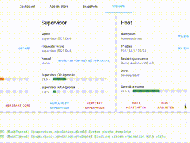

#### 6.4.2 Setup the generic thermostat integration

This integration adds the thermostat function and when configured makes available the thermostat function in Lovelace. 

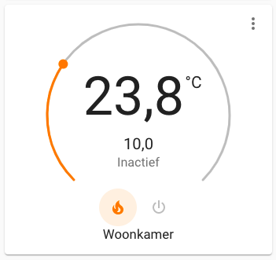

Home Assistant documentation: [Generic thermostat](https://www.home-assistant.io/integrations/generic_thermostat/)

Choices for configuration variables:

*   `target_temp` I chose target temps within configuration.yaml lower than I actually want, cause with a sudden a reboot of the system I don't want the heating to turn on. I use automations to override the temperature to set these to desired temperatures. After a restart the `target_temp` is reverted back to the last setting before the reboot. See Automations further on.
*   `min_cycle_duration` Set so that pump and gas furnace of boiler don't have to turn on and off that often. Set to 3 minutes for bedroom and 1 minute for living room. The living room has a larger radiator and 1 minute turned out as a good value. For the bedroom 3 minutes as the there is a smaller radiator.
*   `heater` I use two `generic_thermostat` instances with separate heater switches, because Generic thermostat isn't able to work with multiple zones (described [here](https://community.home-assistant.io/t/need-help-with-multi-zone-generic-thermostat-climate-configuration/8563)) when one heater switch is on both rooms (they will contradict). For each room I used a [Helper](https://www.home-assistant.io/integrations/input_boolean/), `input_boolean` switch. Trough an automation I made sure these helpers are controlling the relay switch, which controls the on-off signal to the boiler, see [automations](#automations).

**Part in Configuration.yaml**

```yaml

climate:
- platform: generic_thermostat
  name: Livingroom
  heater: input_boolean.schakelaar_woonkamer
  target_sensor: sensor.ds18b20_woonkamer_correctie
  min_temp: 12
  max_temp: 22
  ac_mode: false
  min_cycle_duration:
    minutes: 1
  target_temp: 18.0
  cold_tolerance: 0
  hot_tolerance: 0
  initial_hvac_mode: "heat"
  away_temp: 16
  precision: 0.1
- platform: generic_thermostat
  name: Bedroom
  heater: input_boolean.schakelaar_slaapkamer
  target_sensor: sensor.serial_sensor
  min_temp: 10
  max_temp: 22
  ac_mode: false
  min_cycle_duration:
    minutes: 3
  target_temp: 12.0
  cold_tolerance: 0
  hot_tolerance: 0
  initial_hvac_mode: "heat"
  away_temp: 16
  precision: 0.1
  
```

#### 6.4.3 Telegram integration

I use [Telegram](https://telegram.org/) for notifications. Currently I am using two notifications:

*   Hours of heating during a week on Sunday at 18:00


Translation: "Last week there were 21 hours of heating"

*   When the heating is automatically turned off because of a suspected open window (See [Window open detection](#windowopendetection)).


Translation: "Bedroom thermostat turned off bc of too slow heating up, window open?"

Home Assistant documentation: [Telegram polling](https://www.home-assistant.io/integrations/telegram_polling/)

```yaml
telegram_bot:
  - platform: polling
    api_key: secret
    allowed_chat_ids:
      -  secret


notify:
  - platform: telegram
    name: Telegramnotifier
    chat_id: secret
```

#### 6.4.4 Trend sensor for possible open window detection

Using the [trend platform](https://www.home-assistant.io/integrations/trend/) it is checked if the temperature will rise enough while heating. If not, it can be assumed that a window is open or some other error is happening and the heating is turned off. See [automations](#automations). 

The `min_gradient` value, which is the temperature rising per second, for each room is set based on trial and error. 

```yaml

  - platform: trend
    sensors:
      temp_falling_slaapkamer:
        entity_id: sensor.serial_sensor
        sample_duration: 150
        max_samples: 3
        min_gradient: 0.0003
        invert: false
        friendly_name: DeltaT slaapk voldoende
      temp_falling_woonkamer:
        entity_id: sensor.ds18b20_woonkamer_correctie
        sample_duration: 150
        max_samples: 3
        min_gradient: 0.0005
        invert: false
        friendly_name: DeltaT woonk voldoende
```

```yaml

sensor:
  - platform: time_date
    display_options:
      - 'time'
      - 'date'
      - 'date_time'
  - platform: template
    sensors:
      deltat_slaapkamer:
        value_template: "{{state_attr('binary_sensor.temp_falling', 'gradient')|float * 1000}}"
        friendly_name: 'Slaapkamer temp gradient'
        unit_of_measurement: 'graden'
      deltat_slaapkamer_grens:
        value_template: "{{state_attr('binary_sensor.temp_falling', 'min_gradient')|float * 1000}}"  
        friendly_name: 'Slaapkamer min gradient'
        unit_of_measurement: 'graden'
      deltat_woonkamer:
        value_template: "{{state_attr('binary_sensor.temp_falling_woonkamer', 'gradient')|float * 1000}}" 
        friendly_name: 'Woonkamer temp gradient'
        unit_of_measurement: 'graden'
      deltat_woonkamer_grens:
        value_template: "{{state_attr('binary_sensor.temp_falling_woonkamer', 'min_gradient')|float * 1000}}"
        friendly_name: 'Woonkamer min gradient'
        unit_of_measurement: 'graden'    
      heating_state:
        value_template: "{{state_attr('climate.woonkamer', 'hvac_action')}}"
        friendly_name: 'thermostaat state'
   
```

### 6.5 Setting temperature time program

Two automations per room, one for setting the desired set-temperature at bedtime and one at wake-up time. Also a helper `input_number.current_insteltemp_slaapkamer` is set with the current-set temperature. This is needed for restoring the set temperatures after restart of the system and after a manual change.  

Uses below variables (screenshot from Lovelace dashboard)

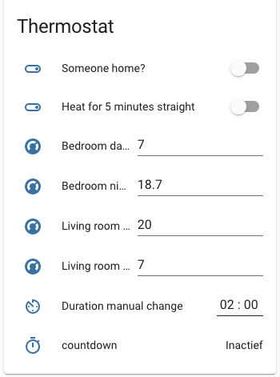

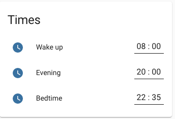

I am aware that there is a Home Assistant plugin called [Schedy](https://hass-apps.readthedocs.io/en/stable/apps/schedy/index.html), which provides a lot of features that would come in hand for the desired configuration. However, as it isn't a native integration within Home Assistant, it is possible that compatibility with Home Assistant will be be lost in the future because of updates on Home Assistant. Therefore I chose to go with setting my own automations which are more reliable for the future. 

**Bedroom set temperature after bedtime**

```yaml

- id: '1587807892892'
  alias: Slaapkamer naar instelwaarde 's nachts
  description: ''
  trigger:
  - at: input_datetime.bedtijd
    platform: time
  condition: []
  action:
  - data_template:
      entity_id: climate.slaapkamer
      temperature: '{{ states.input_text.slaapkamer_insteltemp_nacht.state }}'
    service: climate.set_temperature
  - service: input_number.set_value
    data:
      value: '{{ states.input_text.slaapkamer_insteltemp_nacht.state }}'
    entity_id: input_number.current_insteltemp_slaapkamer
  mode: single
  
```

**Living room to set temperature on wake up time**

```yaml

- id: '1589611935632'
  alias: Woonkamer instelwaarde na opstaan
  description: ''
  trigger:
  - at: input_datetime.opstaan
    platform: time
  condition: []
  action:
  - data_template:
      entity_id: climate.woonkamer
      temperature: '{{ states.input_text.woonk_overdag.state }}'
    service: climate.set_temperature
  - service: input_number.set_value
    data:
      value: '{{ states.input_text.woonk_overdag.state }}'
    entity_id: input_number.current_insteltemp_woonkamer
  mode: single
  
```

**Bedroom to set temperature on wake up time**

```yaml

- id: '1587807715263'
  alias: Slaapkamer naar instelwaarde overdag
  description: ''
  trigger:
  - at: input_datetime.opstaan
    platform: time
  condition: []
  action:
  - data_template:
      entity_id: climate.slaapkamer
      temperature: '{{ states.input_text.slaapkamer_insteltemp_overdag.state }}'
    service: climate.set_temperature
  - service: input_number.set_value
    data:
      value: '{{ states.input_text.slaapkamer_insteltemp_overdag.state }}'
    entity_id: input_number.current_insteltemp_slaapkamer
  mode: single
  
```

**Living room set temperature after bedtime**

```yaml

- id: '1587310221936'
  alias: Woonkamer instelwaarde na bedtijd
  description: ''
  trigger:
  - at: input_datetime.bedtijd
    platform: time
  condition: []
  action:
  - data_template:
      entity_id: climate.woonkamer
      temperature: '{{ states.input_text.woonk_nacht.state }}'
    service: climate.set_temperature
  - service: input_number.set_value
    data:
      value: '{{ states.input_text.woonk_nacht.state }}'
    entity_id: input_number.current_insteltemp_woonkamer
  mode: single
  
```

### 6.6 Triggering heating with two generic thermostat entities

As there are two zones in this situation, living room and bedroom, two thermostat instances are needed.  
The [generic thermostat integration](https://www.home-assistant.io/integrations/generic_thermostat/) is equipped to work only with one temperature sensor. You can run two instances of the generic thermostat integration. However when the heater option is set to the same switch, then when one thermostat is turned on, the other will automatically turn on too (bc they use the same switch,  generic thermostat is programmed like that). This sometimes can lead to situations in which the thermostat of a room will turn on while cold air is flowing in because of a open window. 

Therefore a couple of input\_booleans are created and are set as heater switch. Via an automation the relay switch will be turned on if one of these input\_booleans are turned on. 

Also the someone status `input_boolean.iemandthuis` is taken into account 

#### 6.6.1 Turning on the thermostat when someone home

```yaml
- id: '1587373774458'
  alias: Thermostaat aan bij iemand thuis
  description: ''
  trigger:
  - entity_id: input_boolean.iemandthuis
    platform: state
    to: 'on'
  condition: []
  action:
  - data: {}
    entity_id: climate.woonkamer
    service: climate.turn_on
  - data: {}
    entity_id: climate.slaapkamer
    service: climate.turn_on
```

#### 6.6.2 Living room thermostat turn on

```yaml

- id: '1606337912735'
  alias: Woonkamer thermostaat aan
  description: ''
  trigger:
  - platform: template
    value_template: '{{state_attr(''climate.woonkamer'', ''temperature'') > state_attr(''climate.woonkamer'',
      ''current_temperature'')}}'
  - platform: template
    value_template: '{{ (states.sensor.time.last_changed - states.input_boolean.iemandthuis.last_changed).total_seconds()
      > 5 }}

      '
  - platform: time_pattern
    minutes: '3'
  condition:
  - condition: template
    value_template: '{{state_attr(''climate.woonkamer'', ''temperature'')  > state_attr(''climate.woonkamer'',
      ''current_temperature'')}}'
  - condition: state
    entity_id: input_boolean.iemandthuis
    state: 'on'
  - condition: state
    entity_id: climate.woonkamer
    state: 'off'
  action:
  - service: climate.turn_on
    data: {}
    entity_id: climate.woonkamer
  mode: single
  max: 10
  
```

#### 6.6.3 Bedroom thermostat turn on / off 

```yaml

- id: '1606338268883'
  alias: 'Slaapkamer thermostaat aan '
  description: ''
  trigger:
  - platform: template
    value_template: '{{state_attr(''climate.slaapkamer'', ''temperature'') > state_attr(''climate.slaapkamer'',
      ''current_temperature'')}}'
  - platform: time_pattern
    minutes: '3'
  - platform: template
    value_template: '

      {{ (states.sensor.time.last_changed - states.input_boolean.iemandthuis.last_changed).total_seconds()
      > 5 }}

      '
  condition:
  - condition: template
    value_template: '{{state_attr(''climate.slaapkamer'', ''temperature'') > state_attr(''climate.slaapkamer'',
      ''current_temperature'')}}'
  - condition: state
    entity_id: input_boolean.iemandthuis
    state: 'on'
  action:
  - service: climate.turn_on
    data: {}
    entity_id: climate.slaapkamer
  - wait_for_trigger:
    - platform: template
      value_template: '{{state_attr(''climate.slaapkamer'', ''temperature'') < state_attr(''climate.slaapkamer'',
        ''current_temperature'')}}'
  - service: climate.turn_off
    data: {}
    entity_id: climate.slaapkamer
  mode: restart
  
```

#### 6.6.4 Living room turn thermostat off

```yaml

- id: '1606839006446'
  alias: Woonkamer thermostaat uit
  description: ''
  trigger:
  - platform: template
    value_template: '{{state_attr(''climate.woonkamer'', ''temperature'') < state_attr(''climate.woonkamer'',
      ''current_temperature'')}}'
  - platform: time_pattern
    minutes: '2'
  condition:
  - condition: state
    entity_id: climate.woonkamer
    state: 'on'
  - condition: template
    value_template: '{{state_attr(''climate.woonkamer'', ''temperature'') < state_attr(''climate.woonkamer'',
      ''current_temperature'')}}'
  action:
  - service: climate.turn_off
    data: {}
    entity_id: climate.woonkamer
  mode: restart
  max: 10

- id: '1608297641472'
  alias: terug naar instelwaarde bij restart
  description: ''
  trigger:
  - platform: time_pattern
    minutes: '15'
  condition: []
  action:
  - service: climate.set_temperature
    data:
      temperature: '{{states(''input_number.current_insteltemp_slaapkamer'')}}'
    entity_id: climate.slaapkamer
  - service: climate.set_temperature
    data:
      temperature: '{{states(''input_number.current_insteltemp_woonkamer'')}}'
    entity_id: climate.woonkamer
  mode: single
- id: '1608298248187'
  alias: Helper schakelaars voor klimaat
  description: ''
  trigger:
  - platform: state
    entity_id: input_boolean.schakelaar_slaapkamer
    to: 'on'
  - platform: state
    entity_id: input_boolean.schakelaar_woonkamer
    to: 'on'
  condition: []
  action:
  - service: switch.turn_on
    data: {}
    entity_id: switch.relay
  mode: single
- id: '1608298257006'
  alias: Helper schakelaars UIT klimaat
  description: ''
  trigger:
  - platform: time_pattern
    seconds: '5'
  - platform: state
    entity_id: input_boolean.schakelaar_slaapkamer
    to: 'off'
  - platform: state
    entity_id: input_boolean.schakelaar_woonkamer
    to: 'off'
  condition:
  - condition: state
    entity_id: input_boolean.schakelaar_slaapkamer
    state: 'off'
  - condition: state
    entity_id: input_boolean.schakelaar_woonkamer
    state: 'off'
  action:
  - service: switch.turn_off
    data: {}
    entity_id: switch.relay
  mode: single
- id: '1608318082068'
  alias: Aanwezigheid aan
  description: ''
  trigger:
  - platform: state
    entity_id: input_boolean.iemandthuis
    to: 'on'
  condition: []
  action:
  - service: climate.turn_on
    data: {}
    entity_id: climate.slaapkamer
  - service: climate.turn_on
    data: {}
    entity_id: climate.woonkamer
  mode: single
- id: '1608318174333'
  alias: Aanwezigheid uit
  description: ''
  trigger:
  - platform: state
    entity_id: input_boolean.iemandthuis
    to: 'off'
  condition: []
  action:
  - service: climate.turn_off
    data: {}
    entity_id: climate.slaapkamer
  - service: climate.turn_off
    data: {}
    entity_id: climate.woonkamer
  mode: single
- id: '1608318195860'
  alias: Aanwezigheid uit
  description: ''
  trigger:
  - platform: state
    entity_id: input_boolean.iemandthuis
    to: 'off'
  condition: []
  action:
  - service: climate.turn_off
    data: {}
    entity_id: climate.slaapkamer
  - service: climate.turn_off
    data: {}
    entity_id: climate.woonkamer
  mode: single
  
```

### 6.7 Presence detection


Presence detection is done with both the mobile phone GPS location and a PIR movement sensor in the living room. If the mobile phone was the only source for presence detection this would have been used, but since there is a PIR as well, the away modus of Generic thermostat integration isn't used in this configuration, instead of this a helper switch input (Someone home?).  

I used a PIR sensor next to the smartphone, because there are some disadvantages in using smartphones only for presence detection. There are scenarios like when the battery is down or the phone is on flight mode, in which the system will think someones is home.  Also it is less suitable when having guests if the smartphone is used as only presence detection source. 

The configuration is set so, that when the phone `device_tracker.pra_lx1` changes location from away to home or home to away the helper switch `input_boolean.iemandthuis`  is toggled. So only on **state change**, not on current state. Next to that, the rule is followed that if two movements aren't being detected within the last half hour, the 'someone home status' `input_boolean.iemandthuis` is set to off. 

In the evening the presence detection by the PIR motion detector should be different. It is assumed that if two times a motion is detected within half an hour during `evening time` and `bedtime`, that someone will be home during the entire night. 

As it was noticed that the PIR used in very few occasions can have a false motion detection, the number of two motion detections was chosen. 

This configuration set up is based on a one person household, so only one smartphone with the home assistant app running. 

| Triggers | Between hours | set 'someone home status' to |
| --- | --- | --- |
| Two times a motion detected within 30 minutes period 'someone home status' is off | waking up and evening | on |
| An half an hour with one or less motion detected while 'someone home status' is on | waking up and evening | off |
| Two times a motion detected within 30 minutes period while 'someone home status' is off | evening and bedtime | on |
| Smartphone location state change to away | always | off |
| Smartphone location state change to home | always | on |

The following automations were set to achieve this. 

#### 6.7.1 Automations for presence detection

**Creation of input\_datetime fields**

Two input\_datetime fields have been created for the purpose of presence detection: `input_datetime.beweginglaatst_0` and `input_datetime.bewegingeennalaatst_1` . On a motion detection one is to date/time of the last movement detected and on the next detected motion this value is passed to the other.

This is used, bc it is desired that a minimum of two movements need to be detected in the last 30 minutes to keep the status of some one home, `input_boolean.iemandthuis`, to 'on'.

**Setting the movement input\_datetime fields on motion detection**

```yaml

- id: '1606672315270'
  alias: Movementsensor last 
  description: ''
  trigger:
  - platform: state
    entity_id: binary_sensor.motion_sensor
    to: 'on'
  condition: []
  action:
  - service: input_datetime.set_datetime
    data:
      datetime: '{{states(''input_datetime.beweginglaatst_0'')}}'
    entity_id: input_datetime.bewegingeennalaatst_1
  - service: input_datetime.set_datetime
    data:
      datetime: '{{ now().strftime(''%Y-%m-%d %H:%M:%S'') }}'
    entity_id: input_datetime.beweginglaatst_0
  mode: single
  
```

**Turning of if not more than 1 movement detetected during day**

Timespan: between wake-up time and evening time

Description: Turn off the Someone home status `input_boolean.iemandthuis` when not more than 1 movement. 

```yaml

- id: '1587319961411'
  alias: Gedrag bewegingssensor woonkamer tussen opstaan en avond (overdag)
  description: ''
  trigger:
  - platform: template
    value_template: '{{ (states.sensor.time.last_changed - states.input_datetime.bewegingeennalaatst_1.last_changed).total_seconds()
      > 1800 }}

      '
  - platform: state
    entity_id: person.johan
    to: not_home
  condition:
  - condition: state
    entity_id: input_boolean.iemandthuis
    state: 'on'
  - before: input_datetime.avond
    condition: time
    after: input_datetime.opstaan
  action:
  - data: {}
    entity_id: input_boolean.iemandthuis
    service: input_boolean.turn_off
  mode: single
  
```

#### 6.7.2 Reset the one-before-last-input boolean 31 minutes before waking time

Needed for the someone home status to turn on immediately when entering the living room in the morning, otherwise first two motions need to be detected, which can take a while. 

```yaml

- id: '1606905142912'
  alias: Reset 1 na laatste beweging 31 min voor opstaan
  description: ''
  trigger:
  - platform: time_pattern
    seconds: '30'
  condition:
  - condition: template
    value_template: '{/% set current_time = now().hour * 60 + now().minute %}

      {/% set opstaan_hour, opstaan_minute, opstaan_second = states(''input_datetime.opstaan'').split('':'')
      %}

      {/% set opstaan_time = opstaan_hour | int * 60 + opstaan_minute | int %}

      {{ current_time == opstaan_time - 32 }}'
  action:
  - service: input_datetime.set_datetime
    data:
      datetime: '{{now().strftime(''%Y-%m-%d %H:%M:%S'')}}'
    entity_id: input_datetime.bewegingeennalaatst_1
  mode: restart
  
```

#### 6.7.3 Automation to turn on someone home status

```yaml

- id: '1587319960331'
  alias: Turn on someone home status
  description: ''
  trigger:
  - entity_id: device_tracker.pra_lx1
    platform: state
    to: home
  - entity_id: binary_sensor.motion_sensor
    platform: state
    to: 'on'
  condition:
  - condition: state
    entity_id: input_boolean.iemandthuis
    state: 'off'
  action:
  - data: {}
    entity_id: input_boolean.iemandthuis
    service: input_boolean.turn_on
  mode: single
 
```

#### 6.7.4 Automation during evening and getting up 

Causes 

```yaml

- id: '1587404974211'
  alias: Aanwezigheid detectie avond tot opstaan
  description: ''
  trigger:
  - platform: template
    value_template: '{{ (states.sensor.time.last_changed - states.input_datetime.bewegingeennalaatst_1.last_changed).total_seconds()
      == 300 }}'
  condition:
  - condition: state
    entity_id: input_boolean.iemandthuis
    state: 'off'
  - before: input_datetime.opstaan
    condition: time
    after: input_datetime.avond
  - condition: template
    value_template: '{{ (states.sensor.time.last_changed - states.input_datetime.bewegingeennalaatst_1.last_changed).total_seconds()
      < 300 }}'
  action:
  - data: {}
    entity_id: input_boolean.iemandthuis
    service: input_boolean.turn_on
  mode: single
          
```

#### 6.7.5 Turn off someone home status at wakeup

If home status was on during night it should turn of at waking time in case I wake up later than usual or leave house earlier.

```yaml

- id: '1608290218329'
  alias: Bij opstaan aanwezigheid uit
  description: ''
  trigger:
  - platform: time
    at: input_datetime.opstaan
  condition: []
  action:
  - service: input_boolean.turn_off
    data: {}
    entity_id: input_boolean.iemandthuis
  mode: single

```

#### 6.7.6 Automation between waking up time and evening time

```yaml

- id: '1587319961411'
  alias: Behaviour of motion sensor living room between wakeup time and evening time
  description: ''
  trigger:
  - platform: template
    value_template: '{{ (states.sensor.time.last_changed - states.input_datetime.bewegingeennalaatst_1.last_changed).total_seconds()
      > 1800 }}

      '
  - platform: state
    entity_id: person.johan
    to: not_home
  condition:
  - condition: state
    entity_id: input_boolean.iemandthuis
    state: 'on'
  - before: input_datetime.bedtijd
    condition: time
    after: input_datetime.opstaan
  action:
  - data: {}
    entity_id: input_boolean.iemandthuis
    service: input_boolean.turn_off
  mode: single
  
```

#### 6.7.7 Behavior based on smart phone location with Home Assistant app

```yaml

- id: '1606221709908'
  alias: Smartphone thuiskomen / weggaan
  description: ''
  trigger:
  - platform: state
    entity_id: person.johan
    to: not_home
  condition: []
  action:
  - service: input_boolean.turn_off
    data: {}
    entity_id: input_boolean.iemandthuis
  - wait_for_trigger:
    - platform: state
      entity_id: person.johan
      to: home
  - service: input_boolean.turn_on
    data: {}
    entity_id: input_boolean.iemandthuis
  mode: restart
  
```

#### 6.7.8 Turning off thermostat when Someone home status is off

```yaml
- id: '1587373899805'
  alias: Thermostaat uit bij niemand thuis
  description: ''
  trigger:
  - entity_id: input_boolean.iemandthuis
    platform: state
    to: 'off'
  condition: []
  action:
  - data: {}
    entity_id: climate.woonkamer
    service: climate.turn_off
  - data: {}
    entity_id: climate.slaapkamer
    service: climate.turn_off 
```

### 6.8 Heat for 5 minutes straight

Automation:

```yaml

- id: '1588717917351'
  alias: 5 minuten verwarmen als schakelaar aan
  description: ''
  trigger:
  - entity_id: input_boolean.30_min_verwarmen_schakelaar
    platform: state
    to: 'on'
  condition: []
  action:
  - data: {}
    entity_id: switch.relay
    service: switch.turn_on
  - timeout: 00:05
    wait_template: ''
  - data: {}
    entity_id: switch.relay
    service: switch.turn_off
  - service: input_boolean.turn_off
    data: {}
    entity_id: input_boolean.30_min_verwarmen_schakelaar
  mode: single
```

### 6.9 Anti-frost measures

When there isn't anyone present in the house and the outside temperature is far below zero, the temperature in house can reach very low temperatures. This can cause heating pipes to freeze and break, which will leak when the water melts again and can cause flooding. With this automation the thermostat wil turn on, when the temperature in the bedroom reaches a value below 5 degrees..

Automation:

```
alias: Beveiliging vriezen
description: ''
trigger:
  - platform: time_pattern
    minutes: '5'
condition:
  - condition: numeric_state
    entity_id: climate.slaapkamer
    attribute: current_temperature
    below: '5'
action:
  - service: climate.set_temperature
    data:
      temperature: 5
    entity_id: climate.slaapkamer
  - service: input_boolean.turn_on
    data: {}
    entity_id: input_boolean.iemandthuis
  - service: climate.set_temperature
    data:
      temperature: 5
    entity_id: climate.woonkamer
  - service: climate.turn_on
    data: {}
    entity_id: climate.slaapkamer
  - wait_template: ''
    timeout: '300'
  - service: climate.turn_off
    data: {}
    entity_id: climate.slaapkamer
  - service: input_boolean.turn_off
    data: {}
    entity_id: input_boolean.iemandthuis
mode: single
```

### 6.10 Window open detection

There are no window sensors, but this is based on the temperature rise during heating. If the temperature doesn't rise quickly enough, it is assumed that a window is open and thermostat function will turn off. 

Uses the [Trend sensor](https://www.home-assistant.io/integrations/trend/) to make the `binary_sensor.temp_falling`

After 300 seconds of heating without reaching the treshold of de trend sensor, the thermostat is turned off and sends a Telegram notification:


Translation: "Bedroom thermostat turned off bc of too slow heating up, window open?"

**Automations:**

For the bedroom:

```yaml

- id: '1588799650928'
  alias: Relay beveiging raam open
  description: ''
  trigger:
  - platform: time_pattern
    minutes: '5'
  condition:
  - condition: state
    entity_id: binary_sensor.temp_falling
    state: 'off'
  - condition: template
    value_template: '{{state_attr(''climate.slaapkamer'', ''temperature'') | float
      > state_attr(''climate.slaapkamer'', ''current_temperature'')}}'
  - condition: state
    entity_id: switch.relay
    state: 'on'
  - condition: template
    value_template: '{{ (states.sensor.time.last_changed  - states.switch.relay.last_changed).total_seconds()
      > 310 }}'
  action:
  - service: telegram_bot.send_message
    data:
      message: Slaapkamer thermostaat uitgeschakeld ivm te langzame opwarming, raam
        open?
      target: [chat-number]
  - data: {}
    entity_id: climate.slaapkamer
    service: climate.turn_off
  - delay: 00:45:00
  - service: climate.turn_on
    data: {}
    entity_id: climate.slaapkamer
  mode: single
  
```

 And for the living room:

```yaml

- id: '1601215001454'
  alias: Relay beveiging raam open (woonkamer)
  description: ''
  trigger:
  - platform: template
    value_template: '{{ (states.sensor.time.last_changed  - states.switch.relay.last_changed).total_seconds()
      > 400 }}'
  condition:
  - condition: state
    entity_id: automation.slaapkamer_overgang_off_on_set_schakelaar
    state: 'on'
  action:
  - data: {}
    entity_id: climate.woonkamer
    service: climate.turn_off
  - delay: 00:59:00
  - service: climate.turn_on
    data: {}
    entity_id: climate.woonkamer
  mode: single
  
```

### 6.11 Revert back to programmed set temperature after manual change  

According to `input_datetime.duur_manuele_verhoging` value a timer is started after which the set temperature will revert back to set temperature according to program. 

Uses the [Timer integration](https://www.home-assistant.io/integrations/timer/)

```yaml

- id: '1604920070266'
  alias: Countdown bij manual wijziging
  description: ''
  trigger:
  - platform: state
    entity_id: climate.slaapkamer
    attribute: temperature
  - platform: state
    entity_id: climate.woonkamer
    attribute: temperature
  condition: []
  action:
  - service: timer.start
    data:
      duration: '{{ states.input_datetime.duur_manuele_verhoging.state }}'
    entity_id: timer.countdown
  - delay: '{{ states.input_datetime.duur_manuele_verhoging.state }}'
  - service: climate.set_temperature
    data:
      temperature: '{{ states.input_number.current_insteltemp_slaapkamer.state  }}'
    entity_id: climate.slaapkamer
  - service: climate.set_temperature
    data:
      temperature: '{{ states.input_number.current_insteltemp_woonkamer.state  }}'
    entity_id: climate.woonkamer
  mode: restart
  
```

### 6.12 Telegram notification hours of heating past week on Sunday

```yaml

- id: '1604938488226'
  alias: Notificatie aantal uren verwarmen in week
  description: ''
  trigger:
  - platform: time
    at: '18:00'
  condition:
  - condition: time
    weekday:
    - sun
  action:
  - service: telegram_bot.send_message
    data:
      message: De afgelopen week is er {{ states.sensor.aantal_minuten_verwarmen_laatste_7_dagen.state
        | int}} uren verwarmd.
  mode: single

```

### 6.13 Turn off heating when there is no signal of DS18B20 temperature sensor

It occasionally happens that there is no signal of the DS18B20 temperature sensor or that by mistake the USB cable gets unplugged. The displayed temperature then can get below set temperature and will trigger heating while not really desired. To avoid this an automation is set to turn off. 

```yaml

- id: '1606221459609'
  alias: Beveiliging uitvallen temp sensor
  description: ''
  trigger:
  - platform: numeric_state
    entity_id: climate.slaapkamer
    attribute: current_temperature
    below: '10'
  - platform: numeric_state
    entity_id: sensor.ds18b20_woonkamer_correctie
    below: '10'
  condition: []
  action:
  - service: climate.turn_off
    data: {}
    entity_id: climate.slaapkamer
  - service: climate.turn_off
    data: {}
    entity_id: climate.woonkamer
  mode: single
  
```

## 7. Bypass valve

When using zone heating in your house, consider adding a bypass valve to your central heating plan. A bypass valve will let through water when the pressure in the system gets too high. This avoid damage to the boiler pump because of pumping while all the radiators are closed you can open a small radiator manually or add a bypass valve. I just keep a radiator in my shower always opened.


## 8. Possible improvements to this configuration

Some possible improvements for this design to implement later on:

*   Making a way to control the radiator valves within Home Assistant. As a wired solution is preferred, a possibility is using a zone valve (quite expensive) or a heating actuator. A heating actuator is usually used for floor heating distribution, but might also be suitable for a radiator. Also an interesting and cost effective way is presented here: [Hacking a Eqiva EQ-3 thermostatic radiator valve.](https://www.youtube.com/watch?v=LlPHrdXHBTU)
*   Making use of OpenTherm. The [OpenTherm module](http://ihormelnyk.com/opentherm_adapter) made by Ihor Melnyk is suitable for doing that. Already been fiddling around with this idea, see [my community post.](https://community.home-assistant.io/t/help-needed-with-arduino-sketch-opentherm-module-by-ihor-melnyk/273595/4)
*   Omit the use of a arduino by using long cables for a DS18B20 temperature sensor. I later learned that onewire sensors can work with very long cables. This cuts away the need for using an arduino here.
*   Making more input variables. I can probably do some more of these for instance setting the time the someone home status is turned of when no motion detection. Setting variables helps for not having to open the automations every time.
*   Using thermal sensors for presence detection with for instance the Omron D6T sensors, [youtube link](https://www.youtube.com/watch?v=-beIaL-RmvQ).

### 8.1 Added to the system but not described yet

*   Set a variable time of heating according to the outdoor temperature fetched from an internet source

## 9. Questions / contact

Easiest way is to post a message in [this topic](https://community.home-assistant.io/t/my-multi-zone-thermostat-configuration/319432) on the Home Assistant community forum. 

## 10. Other options for wired configurations

Above configuration uses a USB cable connection to an arduino to my bedroom. This is convenient as it both powers and readouts the arduino. For other, larger houses with multiple temperature sensors and zones this will not be an option, as it's not suitable for long distances.   

Other wired options:

*   a long cable to a 1-wire ds18b20 sensor.  
    This is something that could have been done in this configuration too, but wasn't considered. 1-Wire senors are capable to have quite a distance.
*   Ethernet wires to ESP32 microcontrollers with ethernet   
    Among other options, the [ESPHome](https://www.esphome.io/) platform can be used by using an [Olimex POE device](https://www.olimex.com/Products/IoT/ESP32/ESP32-POE-ISO/open-source-hardware) or a [Wt32-eth01](https://community.home-assistant.io/t/how-i-installed-esphome-on-the-wt32-eth01/359027). Entities from these devices will be available in Home Assistant, when they are connected to the network Home Assistant is running on.

<table><tbody><tr><td><figure class="image"></figure></td></tr><tr><td>The Olimex-poe-iso, device with Ethernet connection</td></tr></tbody></table>

*   Arduino with an ethernet module, like the W5500, with MQTT sending/receiving   
    Cheaper hardware, but more work to be done for the configuration
*   [Modbus](https://www.home-assistant.io/integrations/modbus/)   
    An older but also available protocol for sending data trough two wired cables. Can be convenient to use with existing cables running trough a home.

**Power over Ethernet (PoE)**

Power over Ethernet can be very convenient in a wired configuration. PoE devices are providing both power and a data connection through one cable. This dismisses the need for adding power to the device by an extra power source. PoE is not available on all Ethernet connections, a PoE router or switch is needed.   

## 11. External links

[Home Assistant community forum](https://community.home-assistant.io/)

**I used these webpages for inspiration:**

A tutorial:  [Siytek - the ultimate home-assistant DIY guide for multiple zone heating](https://siytek.com/the-ultimate-home-assistant-diy-thermostat-guide-for-single-or-multiple-zone-heating/)

A nice project by Davide Perini which also uses a PIR motion detector and has a 3D printed case and a LCD screen:  [github.com/sblantipodi/smart\_thermostat](https://github.com/sblantipodi/smart_thermostat)

**For future ideas:**

[Hacking a Eqiva EQ-3 thermostatic radiator valve.](https://www.youtube.com/watch?v=LlPHrdXHBTU)

An interesting idea: [using Omron D6T thermal sensors as room presence detection](https://www.youtube.com/watch?v=-beIaL-RmvQ)

[Opentherm module](http://ihormelnyk.com/opentherm_adapter) by Ihor Melnyk

An interesting idea is to use heating actuators on the radiator controlled by relays. These actuators are actually designed for floor heating manifolds. [This topic](https://community.openhab.org/t/my-central-heating-solution-using-thermal-actuators/41320) on the Openhab forum discusses this option. 

Below a photo from that topic. 


